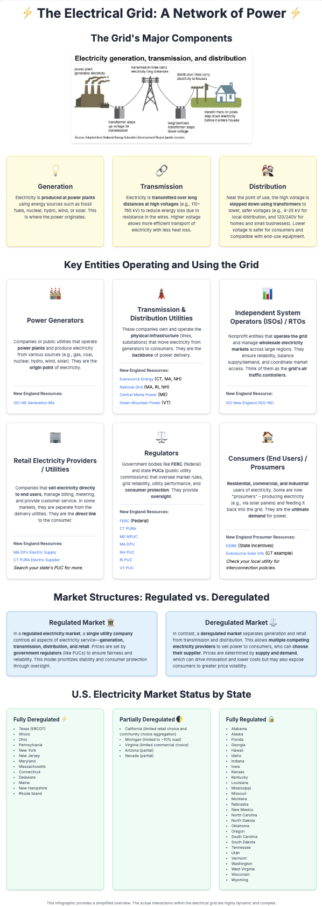

# Electrical Grid Infographic

## Project Overview

This project presents a simple, static infographic designed to explain the key components, entities, and market structures of the electrical grid. It serves as a clear and accessible visual aid for understanding how electricity is generated, transmitted, distributed, and managed.



## Viewing the Infographic

The easiest way to view the infographic is by opening the `index.html` file in a web browser.

Alternatively, for a more production-like viewing experience, you can run a simple local web server:

1.  **Ensure Node.js is installed.** If not, you can download it from [nodejs.org](https://nodejs.org/).
2.  **Open your terminal or command prompt.**
3.  **Navigate to the project folder.**
4.  **Install project dependencies (if this is your first time running it):**

bash

- `npm install`

5.  **Start the local server:**


bash 

- `npm start`

6.  **Open your web browser** and go to the address provided in the terminal output (typically `http://localhost:3000`).

## Technology Used

*   **HTML:** For the structure and content of the infographic.
*   **Tailwind CSS:** A utility-first CSS framework used for styling and layout.
*   **Node.js & npm:** Used to run a simple local web server for viewing the static site.

## Project Files

The main infographic content is in `index.html`. The image used in the infographic is located in the `src/` folder. Project configuration and dependencies are managed in `package.json` and `package-lock.json`. The screenshot for this README is in the `src/` folder.
=======
# React + TypeScript + Vite

This template provides a minimal setup to get React working in Vite with HMR and some ESLint rules.

Currently, two official plugins are available:

- [@vitejs/plugin-react](https://github.com/vitejs/vite-plugin-react/blob/main/packages/plugin-react) uses [Babel](https://babeljs.io/) for Fast Refresh
- [@vitejs/plugin-react-swc](https://github.com/vitejs/vite-plugin-react/blob/main/packages/plugin-react-swc) uses [SWC](https://swc.rs/) for Fast Refresh

## Expanding the ESLint configuration

If you are developing a production application, we recommend updating the configuration to enable type-aware lint rules:

```js
export default tseslint.config({
  extends: [
    // Remove ...tseslint.configs.recommended and replace with this
    ...tseslint.configs.recommendedTypeChecked,
    // Alternatively, use this for stricter rules
    ...tseslint.configs.strictTypeChecked,
    // Optionally, add this for stylistic rules
    ...tseslint.configs.stylisticTypeChecked,
  ],
  languageOptions: {
    // other options...
    parserOptions: {
      project: ['./tsconfig.node.json', './tsconfig.app.json'],
      tsconfigRootDir: import.meta.dirname,
    },
  },
})
```

You can also install [eslint-plugin-react-x](https://github.com/Rel1cx/eslint-react/tree/main/packages/plugins/eslint-plugin-react-x) and [eslint-plugin-react-dom](https://github.com/Rel1cx/eslint-react/tree/main/packages/plugins/eslint-plugin-react-dom) for React-specific lint rules:

```js
// eslint.config.js
import reactX from 'eslint-plugin-react-x'
import reactDom from 'eslint-plugin-react-dom'

export default tseslint.config({
  plugins: {
    // Add the react-x and react-dom plugins
    'react-x': reactX,
    'react-dom': reactDom,
  },
  rules: {
    // other rules...
    // Enable its recommended typescript rules
    ...reactX.configs['recommended-typescript'].rules,
    ...reactDom.configs.recommended.rules,
  },
})
```
=======
# electrical-grid-infographic

